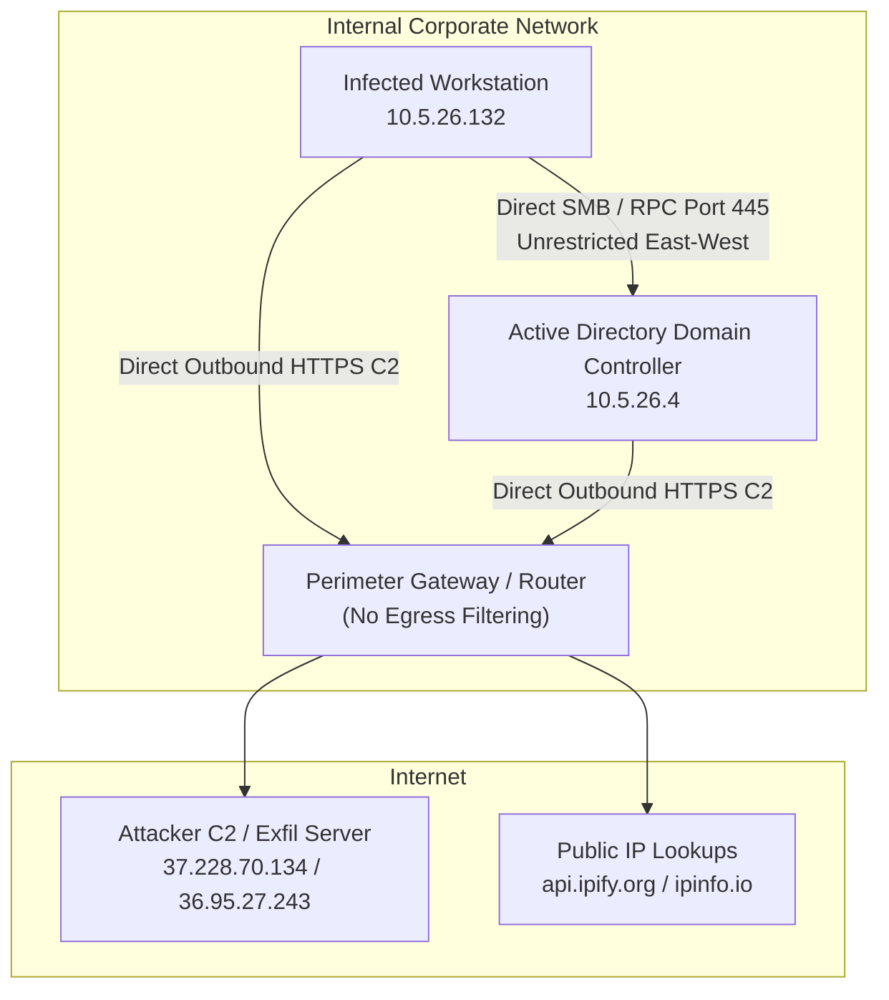
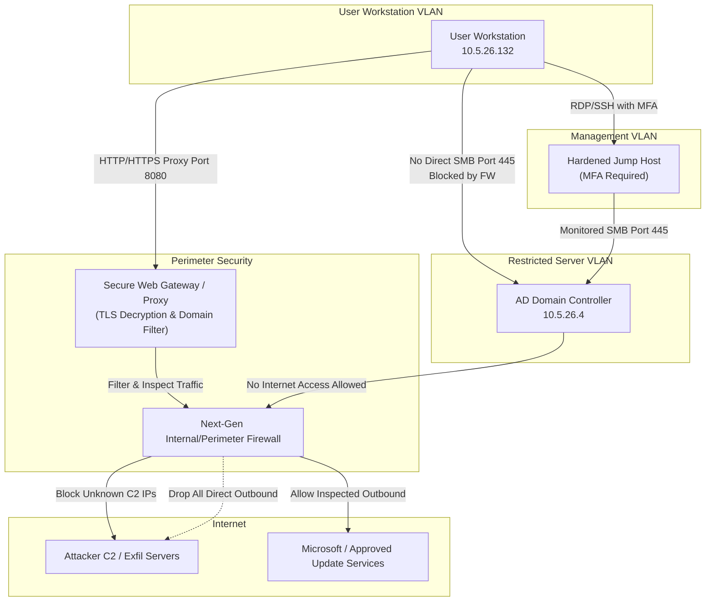

# Workstream A Report — Network Forensics & Architecture

**Project KAVACH · Workstream A · Network Forensics & Architecture**

---

## 1. Executive Summary of Network Findings
A forensic review of the 72-hour incident packet capture (`2021-05-26-Trickbot-infection-with-Cobalt-Strike.pcap`) was conducted to trace anomalous traffic patterns. The analysis confirmed a staged infection flow matching a banking trojan (Trickbot) lateral movement and Cobalt Strike beaconing campaign:
1. **Initial Footprint**: Workstation `10.5.26.132` was compromised and initiated connection testing to public IP discovery services (`api.ipify.org`).
2. **C2 & Exfiltration**: System profiling information was exfiltrated to malicious external endpoints (`36.95.27.243` and `103.102.220.50`) via HTTP POST requests, followed by the start of Cobalt Strike HTTPS beaconing to `37.228.70.134` at highly structured 200-second intervals.
3. **Lateral Movement**: The attacker leveraged weak internal segmentation to connect from the workstation to the Active Directory Domain Controller (`10.5.26.4`) via SMB (port 445), using RPC service creation (`svcctl`) to deploy the implant to the DC.
4. **DC Compromise**: Within 5 minutes, the Domain Controller began executing external IP lookups and beaconing to the C2 servers, representing a complete Active Directory domain compromise.

---

## 2. Evidence Mapping (MITRE ATT&CK)

All findings have been validated and mapped to the MITRE ATT&CK framework:

| Incident Stage | MITRE technique | Key Packets / Frames | Forensic Evidence |
|---|---|---|---|
| **Reconnaissance** | T1016 (System Network Configuration Discovery) | Frame 818, 10962 | Workstation queries `api.ipify.org` and DC queries `ipinfo.io` to check public NAT IPs. |
| **Command and Control** | T1071.001 (Web Protocols / HTTPS C2) | Frames 791, 13300, 19220 | Workstation establishes direct HTTPS connections to `37.228.70.134` with missing SNI extensions at a periodic interval of ~202 seconds. |
| **Data Exfiltration** | T1041 (Exfiltration Over C2 Channel) | Frames 2910, 3045, 13210 | Structured HTTP POST requests containing host profiling data and hash fingerprints in the URI path sent to external IPs. |
| **Lateral Movement** | T1021.002 (SMB/Windows Admin Shares) | Frame 10799, 10803 | Infected workstation initiates an SMB session on port 445 against the DC, connecting to the `IPC$` share. |
| **Execution** | T1543.003 (Windows Service via svcctl) | Frames 10799–10811 | RPC calls to `svcctl` create and start a remote service on the DC, executing the malware binary. |

---

## 3. Architecture Proposal (Before vs. Proposed)

The investigation revealed that a lack of internal microsegmentation and missing egress filters at the perimeter directly enabled the lateral movement and exfiltration. 

Below is the network architecture diff showing the current state versus the proposed hardened security architecture.

### Current Flat Architecture (Vulnerable)
In the current state, the network is flat. Workstations have direct network-level access to Domain Controllers, and any host can establish arbitrary outbound connections on HTTP/HTTPS ports.

### Proposed Hardened Architecture (Microsegmented & Filtered)
The proposed architecture enforces three primary controls:
1. **Perimeter Egress Filtering**: Restricts outbound traffic on ports 80/443. All web traffic must route through a Secure Web Gateway proxy. Servers (like the DC) are completely blocked from direct outbound Internet access.
2. **East-West Microsegmentation**: Places Domain Controllers in a restricted Server VLAN. Workstations cannot connect to DC administrative ports (such as SMB port 445 or RPC) directly. All administrative access must traverse a hardened Jump Host with Multi-Factor Authentication (MFA).
3. **DNS Firewalling**: Directs all internal DNS queries through a secure DNS resolver that blocks requests to known malicious/unrated domains.

---

## 4. Key Architectural Recommendations
1. **Implement East-West Microsegmentation**: Deploy firewalls to isolate Active Directory Domain Controllers. Restrict incoming connections to the DC on ports 135, 139, 445 (SMB), and LDAP to authorized hosts only (Jump Hosts, secondary DCs).
2. **Restrict Egress Traffic**: Block all direct outbound traffic from the Server segment to the Internet. Force workstation Internet egress through an inspected proxy (Secure Web Gateway) with category-based blocking.
3. **Enforce DNS Security**: Block outbound port 53 (DNS) queries to external public resolvers (e.g., Google `8.8.8.8`). Configure internal DNS servers to forward queries through a secure threat-intelligent DNS firewall.
